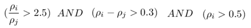
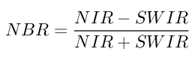
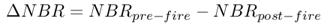

# Exercise 4: Introduction to raster

## Your task
Wildfires have been a hot topic over the last years, with large forested areas being affected. The area of Butte County, Northern California, was devastated by a wildfire called [Camp Fire](https://en.wikipedia.org/wiki/Camp_Fire_(2018)) that started on November 8th 2018. The Camp Fire was the deadliest and most destructive wildfire in California's history, and lasted until after 16th November 2018.

For more than a decade, satellite remote sensing *active fire data* has been used to inform fire management systems. It can aid in fire containment and suppression, but can also be used for assessment of fire-affected areas that will need stabilization and restoration efforts.

In this exercise, you will detect active wildfires and the extent of fire damage using Landsat imagery. You will design a processing chain for detecting **active fires** using freely available Landsat 8 and Landsat 7 images, and provide information about the temperature of these fires.

## Data
* The Landsat data can be found [here](https://github.com/GeoScripting-WUR/IntroToRaster/releases/download/landsat-data/Geoscripting_Exercise_4.zip).
* There are Landsat Surface Reflectance scenes of 4 dates (placed in subdirectories): 
  * start of the fire - November, 
  * end of the fire - November,
  * month before the fire - October (only needed for the extra task!), 
  * month after the fire - December (only needed for the extra task!)
* There are 2 Landsat Surface Temperature images (suffixed with `_ST.tif`):
  * start of the fire - November
  * end of the fire - November
* Use [this USGS page](https://www.usgs.gov/faqs/what-naming-convention-landsat-collections-level-1-scenes?qt-news_science_products=0#qt-news_science_products) to figure out the dates of the Landsat scenes.
* Use [this overview](https://www.usgs.gov/faqs/what-are-best-landsat-spectral-bands-use-my-research?qt-news_science_products=0#qt-news_science_products) to find the correct bands for the fire detection area for each sensor.

## Formula
Active fires can be detected using the following formula using the Surface Reflectance in the specified spectral channels:

     

where ρi is the reflectance of the band that has 2080-2350 nm; ρj is the reflectance of the band that has 760-900 nm. 

## Requirements
- Task 1: Visualize the two Landsat Surface Reflectance scenes from November to become familiar with them. Plot them in RGB. Pay attention to correctly identifying which [band is which](https://www.usgs.gov/faqs/what-are-best-landsat-spectral-bands-use-my-research?qt-news_science_products=0#qt-news_science_products). Have a look at the `stretch` parameter. Save the resulting two images separately in the output folder as `$FOLDERNAME$.png`, where `$FOLDERNAME$` is the name of the corresponding scene folder (i.e. `LC08044322018.......png`).

- Task 2: Create a function called `detectFires` in a file called `detectFires.R` in the `R` folder. This function should detect active fires using the formula as provided above. The function has to be usable for both the start and end image. Source and use this function in your `main.R` script. Plot the active fires at both moments in one map with an informative title. Add a legend to indicate which color on the map corresponds to which date. Save the map as `Active_fires_California.png` in the `output` folder.

- Task 3: Calculate the average and maximum temperature (in Celsius) of the active fires for both scenes using the Surface Temperature images. Assign them to the following variable names: `T_start_mean`, `T_start_max`, `T_end_mean`, `T_end_max`.

- Project structure:
    -	The data should be downloaded in your script, and saved in a folder called `data`, also created in your script. As such, there should be no `data` folder in your Git repository.
    -	All output should be saved in a folder called `output`, created in your script. As such, there should be no `output` folder in your Git repository.

## Hints
* Be careful with reading raster layers and check intermediate results. For instance, `fire_start[[1]]` might not be `sr_band1` as you would expect.
* When creating a map, the title and legend of the plot are key to understanding the purpose of the map, without leaving room for interpretation. In this exercise, practice including these elements in your output of task 2.
    * To plot your output image with a legend for categorical data, convert your raster to a categorical raster using `as.factor()` and set labels using `levels()`. 
    * Label the elements of the legend appropriately.
    * Add a title to the plot with details about the purpose of the map.
* You can save plots as PNG with `png` (check `?png`). Example: `png(filename="output/[FILENAME].png", width=800, height=500)`.
* If the visualization is behaving strange, use `dev.off()` to clear the plot memory and retry.
* The Surface Temperature products have a different projection and extent than the Surface Reflectance product. Use the functions `project` and `crop` to be able to calculate the temperatures for the active fires for task 3. 
* When calculating the temperature in Celsius, have a look at the [Surface Temperature product guide](https://prd-wret.s3-us-west-2.amazonaws.com/assets/palladium/production/atoms/files/LSDS-1330-LandsatSurfaceTemperature_ProductGuide-v2.pdf) (page 9) to understand the pixel values. *Extra tip*: use `na.rm = TRUE`.

## Extra (only attempt if you finished and tested the above without errors)
Calculate the total size of the area affected by the fire using the Landsat scenes from October and December, combined with a severity classification. We will use the Normalized Burn Ratio (NBR) index, which is calculated using the following formula:

   

The formula is similar to a normalized difference vegetation index (NDVI), except that it uses near-infrared (NIR) and shortwave-infrared (SWIR) portions of the electromagnetic spectrum. By comparing the NBR values from before and after the fire, you can obtain information about the extent and severity of the fire event. To calculate the difference NBR, subtract the post-fire NBR raster from the pre-fire NBR raster as follows:

   

Use the Images acquired before and after the fire event to calculate the difference NBR. The severity of the fire can now be classified as follows:

|ΔNBR	|Burn Severity|
|-----|-------------|
|< -0.25 	|High post-fire regrowth| 
|-0.25 to -0.1 	|Low post-fire regrowth| 
|-0.1 to +0.1 	|Unburned| 
|0.1 to 0.27 	|Low-severity burn| 
|0.27 to 0.66 	|Moderate-severity burn| 
|> 0.66 	|High-severity burn| 

*NOTE: your min and max values for NBR may be slightly different from the table shown above! If you have a smaller min value (< -0.7) or you have a largest max value (>1.5) you can set those values to NA.*

Classify the Burn Severity using the table above and use the results to plot a map showcasing the aftermath of the fire. Save it in the output folder as `Camp_fire_severity.png`. Calculate the total size of the area affected by the fire (check out `global()`), and display it in the title of the map.

***Tip***: If you’re in a hurry to finish, here are some nice colours for this final map: `col=c("#81a80c","#d0eb7f","#dddedc","#ffff00","#ffbf00","#ff0000")`
